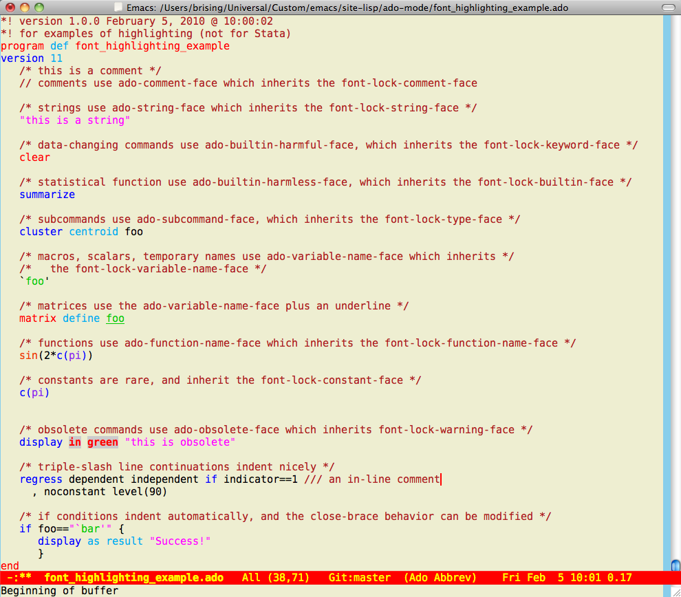

## Installing the Emacs Ado-mode
### Basic Installation Instructions

Emacs is getting more user-friendly all the time (especially [Aquamacs Emacs](http://aquamacs.org) on the Mac), but it still has some unixy ways of doing things which allow great freedom at the price of obscure installation instructions.

1. Be sure you have a pretty recent version of Emacs. Versions 25, 24 and 23 work fine.

2. Grab the distro from this github site.

3. Decide where you should put the `ado-mode` folder. If you are installing this for yourself only, put the `ado-mode` folder in the place you keep your other emacs customizations. \
   a. Some versions of emacs have a place dedicated for user-installed packages&mdash;if your Emacs has it, you can find it with `C-h v user-emacs-directory`. \
   b. If you have no such folder, make an `emacs` folder in a useful place, and add it to your `load-path`: \
	   `(setq load-path (cons "/Someplace/Useful/emacs" load-path))`

4. After you have a place to hold customizations, move the `ado-mode` folder into it. Remember this location. (For the instructions, I'll assume you put things in this my non-standard useful place:`/Universal/Custom/emacs/ado-mode`.)

5. Add the following two lines to your initialization file: \
  `(add-to-list 'load-path "/Universal/Custom/emacs/ado-mode/lisp")` \
  `(require 'ado-mode)` \
  (The initialization file used to be called the `.emacs` file, but what is named on your system depends on the type of Emacs you are running. If you are unfamiliar with such files, open up Emacs and use `C-h i` to bring up info, then type `m em RET m init file` (emacese for _menu emacs_, and then _menu init file_) to read the docs on initialization files.)
  
6. `ado-mode` is very customizable&mdash;it is made to automatically store new ado-files in a special directory designated by you, put your name and affiliation at the end of any help files you write, and the like. It also needs to be able to find its templates for do-files, ado-files and help files. You can set all these from within Emacs by using  `M-x customize-group RET ado`, and pay close attention to the group called **Ado Essentials**. 

7. If you would rather work with customization files directly, there are two files in the `setup_aids` folder called `site_scrap.el` and `personal_scrap.el`. It might be worth peeking at these so that you can see what is set.
    * `site_scrap.el` contains the code needed for `ado-mode` to run, but nothing for individual usage.
    * `personal_scrap.el` contains a very few of the variables you might want to set&mdash;you will still want to work inside the built-in customizations.
	     
### Changing appearance
	
You will likely want to change the default colors for the font highlighting. Here is a screenshot of the highlighting I use, and which I find quite readable:
	

	
The font-locking can be changed either by customizing the `ado-mode` faces directly using `M-x customize-group ado-font-lock`, or by changing the `font-lock` faces which are inherited by the ado-mode via `M-x customize-group font-lock-faces`. I prefer the latter, because changes will then stick for all other programming languages (but it requires knowing which ado-mode names come from which Emacs names). In any case, here are the actual colors from the above screen-shot:
  * comment: firebrick
  * string: magenta
  * harmful: red
  * harmless: blue
  * subcommands: DeepSkyBlue2
  * macros: green3
  * functions: OrangeRed2
  * constants: purple2
  * obsolete: background -- grey80, foreground -- red bold
	
To see what colors are available in Emacs, try `M-x list-colors-display`.
	
Note that specifiying the font is system specific. I use the `apple-dejavu sans mono` font, because I like it. Others like other fonts. You should set the font from within emacs by using `M-x customize`, and then clicking the `Faces`, `Basic Faces`, and then click the `show` button next to **Default** face. This will avoid all the platform specific methods for referring to fonts.

### Troubleshooting
	
If you run into trouble, because you keep getting `Symbol's function definition is void: line-number-at-pos` errors, put the following into your `.emacs` file: `(require 'ado-hacks)`. This should cause the proper function get loaded without having it interfere with future updates. (This problem seems to happen for emacs 21.something and earlier, which aren't really supported anyways.)	

If you have any trouble with the installation instructions, [drop me a line](&#109;&#97;&#105;&#108;&#116;&#111;:&#98;&#114;&#105;&#115;&#105;&#110;&#103;&#64;&#109;&#97;&#99;&#46;&#99;&#111;&#109;) so that I can fix them.

If you would like keep up with updates, subscribe to [http://twitter.com/statuses/user_timeline/106578815.rss](http://twitter.com/statuses/user_timeline/106578815.rss), which is the @adomode Twitter account. This seems like an easy way to have a very-low-traffic RSS feed without any maintenance.
